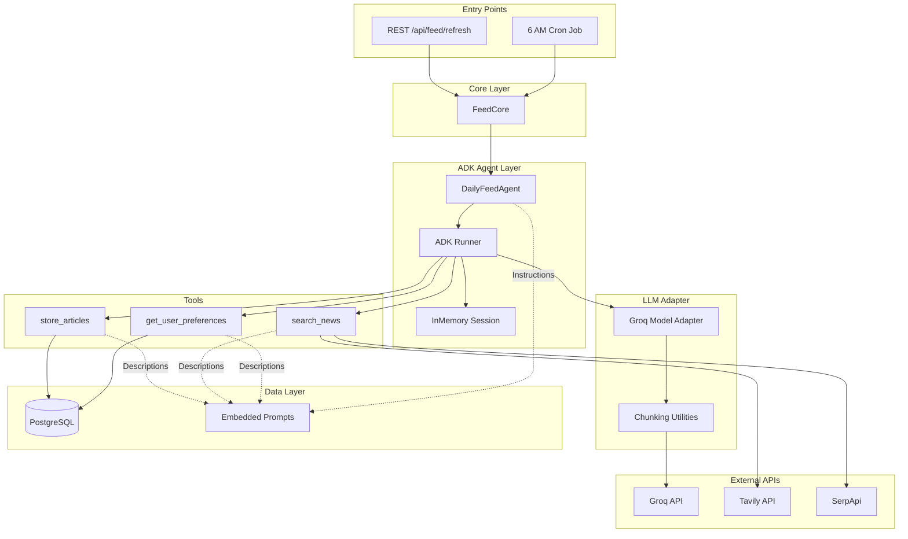
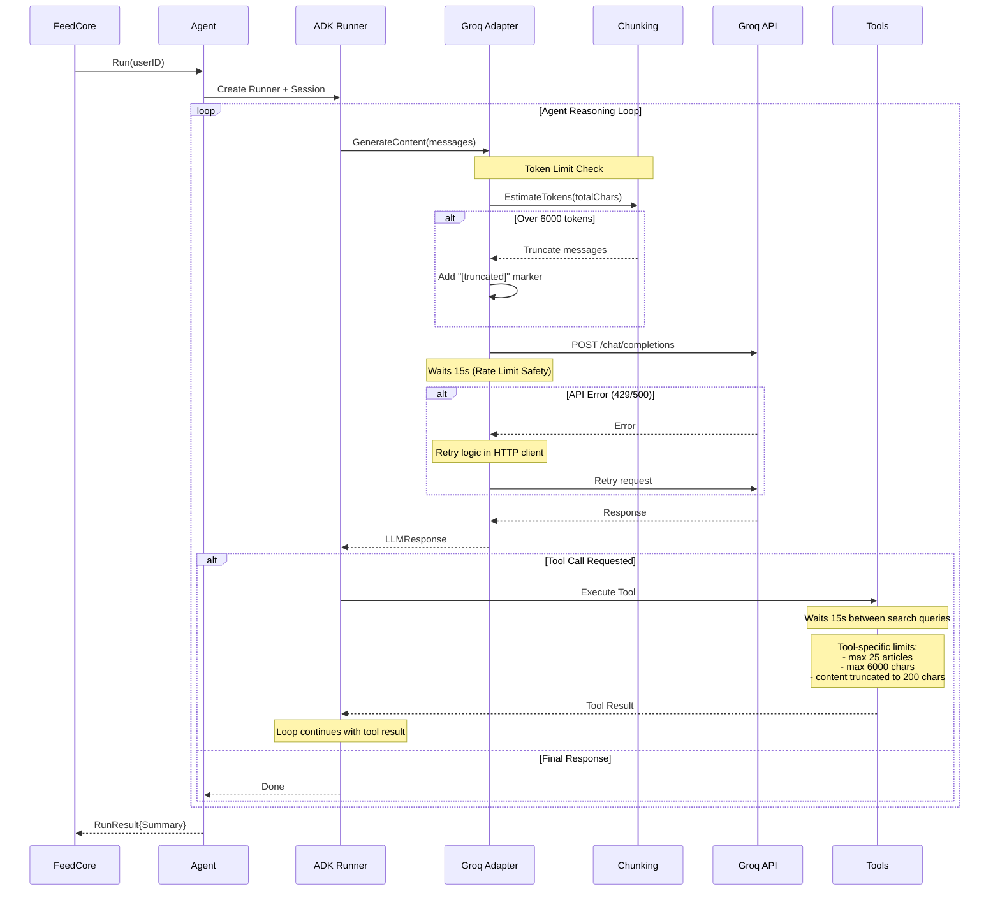

# Learn and Revise (LandR) Architecture

## Overview
LandR is a SaaS application for learning and revision, allowing users to convert materials (text/links) into flashcards using AI.

## Technology Stack

### Backend
- **Language**: Go (Golang)
- **Framework**: gRPC (Google Protocol Buffers)
- **Database**: PostgreSQL (with `pgx` driver)
- **AI**: Multi-provider LLM (Groq + Cerebras)
- **Migrations**: `golang-migrate`

### Frontend
- **Framework**: React Native (Expo)
- **Language**: TypeScript
- **Communication**: gRPC-Web (platform-specific transport)
- **State Management**: Zustand (`authStore.ts`)
- **Data Fetching**: TanStack Query (React Query)
- **Navigation**: Custom manual router
- **Payments**: Razorpay (Checkout.js on Web, Native SDK on Mobile)

## Database Schema

### Tables
1.  **`users`**
    *   `id` (UUID, PK)
    *   `email`, `name`, `google_id`, `picture`
    *   Stores user profile and authentication info.

2.  **`materials`**
    *   `id` (UUID, PK)
    *   `user_id` (FK -> `users.id`)
    *   `type` (TEXT/LINK), `content`, `title`, `source_url`
    *   Stores the source content for learning. `source_url` tracks the original URL for LINKs to prevent duplicate material creation.

3.  **`flashcards`**
    *   `id` (UUID, PK)
    *   `material_id` (FK -> `materials.id`)
    *   `question`, `answer`
    *   `stage` (Spaced Repetition stage), `next_review_at`
    *   Stores generated flashcards and their review state.

4.  **`tags`**
    *   `id` (UUID, PK)
    *   `user_id` (FK -> `users.id`)
    *   `name`
    *   Stores user-defined tags for categorization.

5.  **`material_tags`**
    *   `material_id` (FK -> `materials.id`)
    *   `tag_id` (FK -> `tags.id`)
    *   Join table for Many-to-Many relationship between Materials and Tags.

6.  **`daily_articles`**
    *   `user_id` (FK -> `users.id`)
    *   `title`, `url`, `snippet`, `suggested_date`, `relevance_score`, `provider` (google/tavily)
    *   Stores personalized news/articles for the Daily Feed.

7.  **`subscriptions`**
    *   `user_id` (FK -> `users.id`, PK, One-to-One)
    *   `plan` (FREE/PRO), `status` (ACTIVE, CANCELLED, etc.)
    *   `razorpay_subscription_id` (or `pay_` ID for one-time MVP)
    *   `current_period_end`
    *   Stores user subscription status and validity.

8.  **`usage_quotas`**
    *   `user_id` (FK -> `users.id`)
    *   `resource` (e.g., "generated_cards_daily")
    *   `count`, `last_reset_at`
    *   Tracks daily usage for rate limiting and plan enforcement.

### Relationships
-   **User -> Materials**: One-to-Many (Cascade Delete)
-   **Material -> Flashcards**: One-to-Many (Cascade Delete)
-   **User -> Tags**: One-to-Many
-   **Material <-> Tags**: Many-to-Many (via `material_tags`)


## Backend Architecture
Follows **Clean Architecture** principles:

```mermaid
graph TB
    subgraph "Transport Layer"
        GRPC[gRPC Server :50051]
        REST[REST API :8080]
    end
    
    subgraph "Services"
        AUTH[AuthService]
        LEARN[LearningService]
        FEED[FeedService]
        PAY[PaymentService]
    end
    end
    
    subgraph "Business Logic"
        LCORE[LearningCore]
        FCORE[FeedCore]
        ACORE[AuthCore]
    end
    
    subgraph "Background Workers"
        WORKER[notifications.Worker]
        CRON1[6 AM: Feed Generation]
        CRON2[9 AM: Push Notifications]
    end
    
    subgraph "External Services"
        AI[AI Providers - Groq/Cerebras]
        TAVILY[Tavily Search API]
        SERPAPI[SerpApi Google Search]
        FCM[Firebase Cloud Messaging]
        RAZOR[Razorpay API]
    end
    end
    
    subgraph "Data Layer"
        STORE[PostgresStore]
        DB[(PostgreSQL)]
    end
    
    GRPC --> AUTH & LEARN & FEED
    REST --> FEED
    AUTH --> ACORE
    LEARN --> LCORE
    FEED --> FCORE
    PAY --> RAZOR
    LCORE --> AI
    FCORE --> TAVILY & SERPAPI
    WORKER --> CRON1 & CRON2
    CRON1 --> FCORE
    CRON2 --> LCORE & FCM
    LCORE & FCORE & ACORE --> STORE --> DB
```

### Layer Responsibilities

| Layer | Location | Purpose |
|-------|----------|---------|
| **Transport** | `internal/service/` | gRPC handlers, REST endpoints, request/response mapping |
| **Business Logic** | `internal/core/` | Core application logic, orchestrates AI and DB operations |
| **Data Access** | `internal/store/` | Database implementations, SQL queries |
| **Background Workers** | `internal/notifications/` | Scheduled cron jobs (async, rate-limited) |
| **External Clients** | `internal/ai/`, `internal/tavily/`, `internal/serpapi/`, `internal/firebase/` | Third-party API integrations |

### Key Entry Point
`cmd/server/main.go` - Initializes all components, wires dependencies, and starts:
- gRPC server on port 50051
- gRPC-Web + REST server on port 8080
- Background worker with daily cron jobs

## Frontend Architecture

### Directory Structure
```
frontend/src/
├── components/       # Reusable UI components (AppHeader, etc.)
├── navigation/       # Custom manual router implementation
├── screens/          # Screen components (HomeScreen, DailyFeedScreen, etc.)
├── services/         # API clients (api.ts, directApi.ts)
├── store/            # Zustand state stores (authStore)
└── utils/            # Utilities and config
```

### gRPC-Web Transport Architecture
The frontend uses **platform-specific gRPC-Web implementations**:

#### Web Platform
- Uses **`nice-grpc-web`** with Fetch transport
- Works seamlessly with browser's native Fetch API

#### Native Platform (Android/iOS)
- Uses **custom direct XMLHttpRequest client** (`directApi.ts`)
- Bypasses `nice-grpc-web` due to React Native compatibility issues
- Implements gRPC-Web framing manually.

### Authenticaton
- **Auth State**: Zustand store (`authStore.ts`) manages user session.
- **Provider**: Google Sign-In with JWT validation on backend.

## Data Flow

### Add Material & Duplicate Prevention
1.  Frontend sends `AddMaterialRequest` (Content + Tags).
2.  Backend checks `source_url` in `materials` table to see if the link already exists.
3.  If new, Backend calls AI to generate Flashcards, Title, and Tags.
4.  If existing, Backend returns the existing Material ID.
5.  Frontend navigates to Home and refreshes.

### Review Flashcards (Spaced Repetition)
1.  Users review cards categorized by "Due" status.
2.  Backend manages `stage` (0-5) and `next_review_at` timestamps using a standard SRS algorithm.

## Daily AI Feed Feature

### Overview
Provides users with personalized daily article recommendations based on interests.

### Technical Implementation
- **Providers**: Uses **Tavily** for AI-enhanced search and **SerpApi** for broad Google News results.
- **Granularity**: Articles are stored with a `provider` field, allowing per-provider caching and granular refreshes.
- **UI Interaction**: 
  - **In-App Browser**: Articles open via `expo-web-browser` for a seamless experience.
  - **Quick Revise**: Allows users to save an article for revision directly from the feed.
  - **Status Tracking**: Articles already added to revision lists show **Added ✅** status.

## Push Notifications (FCM)

### Overview
Server-side push notifications for daily "due materials" reminders.

### Technical Implementation
- **Interactive Handlers**: Custom `NotificationHandler` in `App.tsx` captures notification clicks.
- **Navigation**: Deep linking takes users directly to the **Home** (Revision List) screen from a notification click.

## Daily Scheduled Jobs
All jobs run in **IST timezone** managed by `notifications.Worker`.

| Job | Schedule | Description |
|-----|----------|-------------|
| **Feed Generation** | 6:00 AM IST | Fetches articles via Tavily/SerpApi |
| **Push Notifications** | 9:00 AM IST | Sends due material reminders via FCM |

## Environment Variables
- `GROQ_API_KEY`: Primary LLM provider (used by ADK Agent and AI operations)
- `CEREBRAS_API_KEY`: Secondary LLM (optional, for load balancing)
- `TAVILY_API_KEY`: AI-powered search for Daily Feed
- `SERPAPI_API_KEY`: Google search results for Daily Feed
- `JWT_SECRET`: Backend authentication token signing

## Daily Feed Agent (Google ADK)

### Overview
The Daily Feed feature uses a **Google ADK-based agent** for intelligent article curation.

### Architecture


### Key Files
| File | Purpose |
|------|---------|
| `internal/adk/feedagent/agent.go` | Agent V2 definition with 6 tools |
| `internal/adk/tools/feed_tools.go` | All V2 tools (search, scrape, summarize, evaluate, store) |
| `internal/search/provider.go` | SearchProvider interface |
| `internal/search/registry.go` | Dynamic provider registry |
| `internal/tavily/client.go` | Tavily search provider implementation |
| `internal/serpapi/client.go` | SerpApi search provider implementation |
| `pkg/adk/model/factory.go` | Unified factory for creating ADK models |
| `pkg/adk/model/groq/model.go` | Custom Groq adapter implementing ADK's `model.LLM` interface |
| `prompts/agent_daily_feed.txt` | V2 agent instructions (scrape → summarize → evaluate) |
| `prompts/article_evaluation.txt` | Article scoring prompt template |

### Agent V2 Flow
1. Agent receives: `"Generate daily feed for user_id: X"`
2. Calls `get_user_preferences` → retrieves interests + `feed_eval_prompt`
3. Calls `search_news` → queries all registered providers (Tavily, SerpApi, future...)
4. For each article:
   - Calls `scrape_content` → gets full article text
   - Calls `summarize_content` → generates concise summary
   - Calls `evaluate_article` → scores 0.0-1.0 against user criteria
5. Calls `store_articles` → saves articles with score ≥ 0.6

### Execution Sequence (LLM + Chunking + Retry)


### Operational Characteristics
- **Long-Running**: The entire process can take **10-20 minutes**.
- **Delays**: 
    - **Groq Adapter**: **15s delay** before every API call.
    - **Search Tool**: **15s delay** between every search query.
- **Fail-Safe**: Uses `context.Background()` with 30m timeout in REST/Worker to prevent cancellation.

## AI Model Architecture

### Two Types of AI Interfaces

The application uses two distinct AI interfaces for different purposes:

1. **Simple Provider** (`ai.Provider`): For basic AI tasks (flashcards, summaries, completions)
2. **ADK Model** (`adkmodel.LLM`): For agentic workflows with tool calling capabilities

### Unified Factory Pattern

Both types use factory functions for consistent, centralized creation:

| Type | Factory | Returns | Usage |
|------|---------|---------|-------|
| Simple Provider | `ai.NewLLMProvider(name, key, model)` | `ai.Provider` | Learning, Feed services |
| ADK Model | `adkmodel.NewModel(name, key, model)` | `adkmodel.LLM` | Daily Feed Agent |

**Example Usage**:
```go
// For simple AI tasks (flashcards, summaries)
provider := ai.NewLLMProvider("groq", apiKey, models.TaskFlashcardModel)
summary, err := provider.GenerateSummary(content)

// For ADK agents with tool calling
model, err := adkmodel.NewModel("groq", apiKey, models.TaskAgentDailyFeedModel)
agent, err := llmagent.New(llmagent.Config{
    Model: model,
    Tools: []tool.Tool{...},
})
```

### Why Two Interfaces?

- **Simple Provider**: Optimized for single-shot completions, no tool calling overhead
- **ADK Model**: Implements Google's ADK `LLM` interface, supports multi-turn conversations with tool execution

### Extensibility

Both factories use a switch-based pattern, making it easy to add new providers:

```go
// Future: Add Cerebras ADK adapter
case "cerebras":
    return cerebras.NewModel(cerebras.Config{...}), nil
```

## Centralized AI Utilities


### Token Management (`internal/ai/chunking.go`)
Handles Groq's 8k token limit across all AI operations:

| Function | Purpose |
|----------|---------|
| `SplitIntoChunks()` | Splits large content with overlap for context continuity |
| `TruncateToLimit()` | Simple truncation when chunking isn't appropriate |
| `EstimateTokens()` | Rough token count (~4 chars = 1 token) |
| `AggregateResults()` | Combines results from multiple chunks |

### Token Budget
- **Total**: 8000 tokens (Groq free tier)
- **Input**: ~6000 tokens max
- **Response**: ~2000 tokens reserved

## Externalized Prompts (`prompts/`)

All AI prompts are externalized as text files and embedded at compile time:

| File | Usage |
|------|-------|
| `agent_daily_feed.txt` | Agent system instructions |
| `flashcards.txt` | Flashcard generation prompt |
| `summary.txt` | Summary generation prompt |
| `query_optimization.txt` | Search query optimization |
| `tool_*.txt` | Tool descriptions for agent |

Loaded via `go:embed` in `prompts/loader.go` for zero-runtime file I/O.
## Code Organization

### Backend Structure
```
backend/
├── cmd/server/
│   └── main.go                    # Entry point (80 lines - orchestration only)
├── internal/
│   ├── config/
│   │   └── config.go              # Configuration management
│   ├── server/
│   │   ├── init.go                # Service initialization
│   │   ├── http.go                # HTTP middleware (CORS, gRPC-Web, recovery)
│   │   └── rest.go                # REST API handlers
│   ├── ai/
│   │   ├── provider.go            # Provider interface
│   │   ├── base_provider.go       # BaseProvider implementation
│   │   ├── multi_provider.go      # MultiProvider for load balancing
│   │   └── factory.go             # Provider factory functions
│   ├── search/
│   │   ├── provider.go            # SearchProvider interface
│   │   └── registry.go            # Dynamic provider registry
│   ├── adk/
│   │   ├── feedagent/
│   │   │   └── agent.go           # V2 ADK agent
│   │   └── tools/
│   │       └── feed_tools.go      # All 6 V2 tools
│   ├── feed/
│   │   └── constants.go           # Feed configuration constants
│   └── ...
├── pkg/
│   └── adk/
│       └── model/
│           ├── factory.go         # Unified ADK model factory
│           └── groq/
│               └── model.go       # Groq ADK adapter
└── prompts/
    ├── agent_daily_feed.txt       # V2 agent instructions
    ├── article_evaluation.txt     # Article scoring prompt
    ├── tool_*.txt                 # Tool descriptions
    └── loader.go                  # Embedded prompts
```

### Design Patterns

#### 1. Interface-Based Architecture
- **AI Providers**: `Provider` interface with `BaseProvider` and `MultiProvider` implementations
- **Search Providers**: `SearchProvider` interface with Tavily/SerpApi implementations
- **Benefits**: Easy to add new providers, testable, loosely coupled

#### 2. Registry Pattern
- **Search Registry**: Dynamically register N search providers
- **No hardcoding**: Add providers via environment variables
- **Example**:
  ```go
  registry := search.NewRegistry()
  registry.Register(tavily.NewClient(apiKey))
  registry.Register(serpapi.NewClient(apiKey))
  // Future: registry.Register(bing.NewClient(apiKey))
  ```

#### 3. Factory Pattern
- **AI Providers**: `NewLLMProvider(name, apiKey, model)` creates appropriate provider
- **ADK Tools**: `New*Tool(dependencies)` for dependency injection
- **Benefits**: Centralized creation logic, easy configuration

#### 4. Constructor Pattern (`New*`)
- All constructors follow `New*` naming convention
- Set defaults, validate inputs, initialize state
- Examples: `NewBaseProvider()`, `NewRegistry()`, `NewGetPreferencesTool()`

### Key Architectural Decisions

1. **Extensible Search Providers**
   - Interface + Registry pattern allows N providers
   - No code changes needed to add new search APIs
   - Resolves TODOs from feed_v2 workflow

2. **V2 Content-Aware Evaluation**
   - Scrape → Summarize → Evaluate → Store pipeline
   - Uses `feed_eval_prompt` for personalized scoring
   - Only stores articles with score ≥ 0.6

3. **Clean Code Organization**
   - Separated interface from implementations
   - Config, server init, and handlers in separate packages
   - main.go reduced from 400+ to 80 lines

4. **Centralized Configuration**
   - `internal/config` package for all env vars
   - `internal/feed/constants.go` for feed-specific constants
   - `prompts/` package for all AI prompts

## Testing

### Agent Testing
```bash
make test-agent  # Run with mocked search providers
```

### Manual Testing
```bash
# Trigger feed generation for a user
curl -X POST http://localhost:8080/api/feed/refresh?email=user@example.com \
  -H "X-API-Key: $FEED_API_KEY"
```
