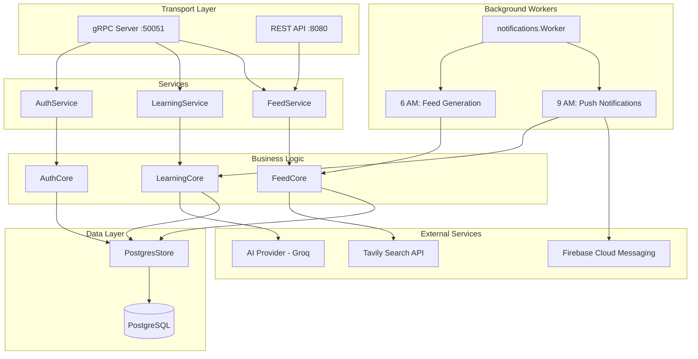

# Learn and Revise (LandR) Architecture

## Overview
LandR is a SaaS application for learning and revision, allowing users to convert materials (text/links) into flashcards using AI.

## Technology Stack

### Backend
- **Language**: Go (Golang)
- **Framework**: gRPC (Google Protocol Buffers)
- **Database**: PostgreSQL (with `pgx` driver)
- **AI**: Groq API (LLM for flashcard generation)
- **Migrations**: `golang-migrate`

### Frontend
- **Framework**: React Native (Expo)
- **Language**: TypeScript
- **Communication**: gRPC-Web (platform-specific transport)
- **State Management**: Zustand (`authStore.ts`)
- **Data Fetching**: TanStack Query (React Query)
- **Navigation**: Custom manual router

## Database Schema

### Tables
1.  **`users`**
    *   `id` (UUID, PK)
    *   `email`, `name`, `google_id`, `picture`
    *   Stores user profile and authentication info.

2.  **`materials`**
    *   `id` (UUID, PK)
    *   `user_id` (FK -> `users.id`)
    *   `type` (TEXT/LINK), `content`, `title`
    *   Stores the source content for learning.

3.  **`flashcards`**
    *   `id` (UUID, PK)
    *   `material_id` (FK -> `materials.id`)
    *   `question`, `answer`
    *   `stage` (Spaced Repetition stage), `next_review_at`
    *   Stores generated flashcards and their review state.

4.  **`tags`**
    *   `id` (UUID, PK)
    *   `user_id` (FK -> `users.id`)
    *   `name`
    *   Stores user-defined tags for categorization.

5.  **`material_tags`**
    *   `material_id` (FK -> `materials.id`)
    *   `tag_id` (FK -> `tags.id`)
    *   Join table for Many-to-Many relationship between Materials and Tags.

### Relationships
-   **User -> Materials**: One-to-Many (Cascade Delete)
-   **Material -> Flashcards**: One-to-Many (Cascade Delete)
-   **User -> Tags**: One-to-Many
-   **Material <-> Tags**: Many-to-Many (via `material_tags`)


## Backend Architecture
Follows **Clean Architecture** principles:



### Layer Responsibilities

| Layer | Location | Purpose |
|-------|----------|---------|
| **Transport** | `internal/service/` | gRPC handlers, REST endpoints, request/response mapping |
| **Business Logic** | `internal/core/` | Core application logic, orchestrates AI and DB operations |
| **Data Access** | `internal/store/` | Database implementations, SQL queries |
| **Background Workers** | `internal/notifications/` | Scheduled cron jobs (async, rate-limited) |
| **External Clients** | `internal/ai/`, `internal/tavily/`, `internal/firebase/` | Third-party API integrations |

### Key Entry Point
`cmd/server/main.go` - Initializes all components, wires dependencies, and starts:
- gRPC server on port 50051
- gRPC-Web + REST server on port 8080
- Background worker with daily cron jobs

## Frontend Architecture

### Directory Structure
```
frontend/src/
├── components/       # Reusable UI components (AppHeader, etc.)
├── navigation/       # Custom manual router implementation
├── screens/          # Screen components (HomeScreen, AddMaterialScreen, etc.)
├── services/         # API clients
│   ├── api.ts        # Platform-aware API export
│   └── directApi.ts  # Direct gRPC-Web client for React Native
├── store/            # Zustand state stores (authStore)
└── utils/            # Utilities and config
```

### gRPC-Web Transport Architecture
The frontend uses **platform-specific gRPC-Web implementations**:

#### Web Platform
- Uses **`nice-grpc-web`** with Fetch transport
- Works seamlessly with browser's native Fetch API
- Supports all gRPC-Web features via standard library

#### Native Platform (Android/iOS)
- Uses **custom direct XMLHttpRequest client** (`directApi.ts`)
- Bypasses `nice-grpc-web` due to React Native compatibility issues
- Implements gRPC-Web framing manually:
  - Frame encoding: 5-byte header (1 byte flag + 4 bytes length) + payload
  - Frame decoding: Parses data frames (flag=0) and trailer frames (flag=128)
  - Trailer parsing: Extracts `grpc-status` and `grpc-message`

**Why Direct Client?**
React Native's JavaScript runtime lacks certain browser globals that `nice-grpc-web` and its dependencies (`nice-grpc-common`) rely on. The direct client uses only `XMLHttpRequest` and protobuf encode/decode functions, which work reliably across all platforms.

### State Management
- **Auth State**: Zustand store (`authStore.ts`) manages user session
- **Server State**: TanStack Query for caching, refetching, and query invalidation
- **Token Storage**: 
  - Web: `localStorage`
  - Native: `expo-secure-store`

### Authentication Flow
1. User initiates Google Sign-In
2. Platform-specific Google auth returns ID token
3. Frontend sends ID token to backend's `AuthService/Login`
4. Backend validates token, creates/retrieves user, returns JWT
5. Frontend stores JWT and user profile in auth store
6. Subsequent API calls include JWT in `Authorization` header

## Data Flow

### Add Material
1.  Frontend sends `AddMaterialRequest` (Content + Tags).
2.  Backend calls AI to generate Flashcards, Title, and Tags.
3.  Backend saves Material, Tags, and Flashcards to DB in a transaction.
4.  Returns created data to Frontend.
5.  Frontend invalidates queries to refresh UI.

### Review Flashcards
1.  Frontend requests `GetDueFlashcards` for a material.
2.  Backend queries `flashcards` joined with `materials` and `tags`.
3.  Frontend displays grouped flashcards with swipe/flip UI.
4.  User marks cards as reviewed, advancing their spaced repetition stage.

## Daily AI Feed Feature

### Overview
Provides users with personalized daily article recommendations. **Disabled by default** – users must opt-in via Settings.

### Database Tables
- **`users`**: Extended with `interest_prompt` (TEXT) and `feed_enabled` (BOOLEAN, default FALSE)
- **`daily_articles`**: Stores articles with `title`, `url`, `snippet`, `suggested_date`, `relevance_score`

### Backend Components
- **`TavilyClient`** (`internal/tavily/client.go`): HTTP client for Tavily Search API
- **`FeedCore`** (`internal/core/feed.go`): Business logic for feed preferences and article generation
- **`FeedService`** (`internal/service/feed.go`): gRPC handlers for `FeedService`

### REST API
- **`POST /api/feed/refresh?email=<email>`**: Manually trigger feed generation for a user

### Frontend Components
- **SettingsScreen**: Toggle + interest prompt input
- **DailyFeedScreen**: Calendar date navigation + article cards with "Read More" links
- **BottomNavBar**: 📰 "Feed" tab

### Environment Variables
- `TAVILY_API_KEY`: Required to enable the Daily Feed feature

## Push Notifications (Firebase Cloud Messaging)

### Overview
Server-side push notifications for daily "due materials" reminders. Uses Firebase Cloud Messaging (FCM) for reliable delivery.

### Database Tables
- **`device_tokens`**: Stores FCM tokens with `user_id`, `token`, `platform` (android/ios)

### Backend Components
- **`firebase.Sender`** (`internal/firebase/sender.go`): Firebase Admin SDK wrapper for sending push notifications
- **`notifications.Worker`** (`internal/notifications/worker.go`): Unified scheduler for all daily jobs
- **`RegisterPushToken`** RPC: Stores device FCM tokens on login

### Frontend Components
- **`firebaseMessaging.ts`**: FCM token registration and permission handling
- Uses `@react-native-firebase/messaging` for native FCM integration

### Notification Format
```
Title: L.and.R - Review Due! 📚
Body: "Introduction to ML" and 2 others are due for revision.
```

### Environment Variables
- `FIREBASE_SERVICE_ACCOUNT`: Path to Firebase service account JSON (default: `firebase/service-account.json`)

## Daily Scheduled Jobs

All jobs run in **IST timezone** and are managed by `notifications.Worker`.

| Job | Schedule | Description | Rate Limit |
|-----|----------|-------------|------------|
| **Feed Generation** | 6:00 AM IST | Fetches personalized articles via Tavily API | 2s between users |
| **Push Notifications** | 9:00 AM IST | Sends due material reminders via FCM | 500ms between users |

### Technical Details
- All jobs run **asynchronously** (in goroutines) to not block the main application
- **Rate limiting** prevents overwhelming external APIs (Tavily, FCM)
- **Panic recovery middleware** prevents crashes from unhandled errors
- Jobs continue processing remaining users if one fails
