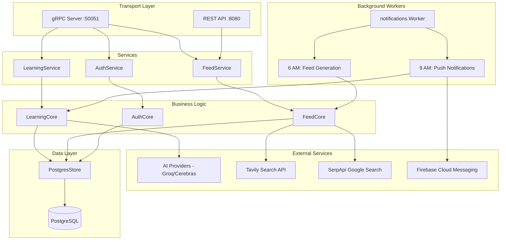

# Learn and Revise (LandR) Architecture

## Overview
LandR is a SaaS application for learning and revision, allowing users to convert materials (text/links) into flashcards using AI.

## Technology Stack

### Backend
- **Language**: Go (Golang)
- **Framework**: gRPC (Google Protocol Buffers)
- **Database**: PostgreSQL (with `pgx` driver)
- **AI**: Multi-provider LLM (Groq + Cerebras)
- **Migrations**: `golang-migrate`

### Frontend
- **Framework**: React Native (Expo)
- **Language**: TypeScript
- **Communication**: gRPC-Web (platform-specific transport)
- **State Management**: Zustand (`authStore.ts`)
- **Data Fetching**: TanStack Query (React Query)
- **Navigation**: Custom manual router

## Database Schema

### Tables
1.  **`users`**
    *   `id` (UUID, PK)
    *   `email`, `name`, `google_id`, `picture`
    *   Stores user profile and authentication info.

2.  **`materials`**
    *   `id` (UUID, PK)
    *   `user_id` (FK -> `users.id`)
    *   `type` (TEXT/LINK), `content`, `title`, `source_url`
    *   Stores the source content for learning. `source_url` tracks the original URL for LINKs to prevent duplicate material creation.

3.  **`flashcards`**
    *   `id` (UUID, PK)
    *   `material_id` (FK -> `materials.id`)
    *   `question`, `answer`
    *   `stage` (Spaced Repetition stage), `next_review_at`
    *   Stores generated flashcards and their review state.

4.  **`tags`**
    *   `id` (UUID, PK)
    *   `user_id` (FK -> `users.id`)
    *   `name`
    *   Stores user-defined tags for categorization.

5.  **`material_tags`**
    *   `material_id` (FK -> `materials.id`)
    *   `tag_id` (FK -> `tags.id`)
    *   Join table for Many-to-Many relationship between Materials and Tags.

6.  **`daily_articles`**
    *   `user_id` (FK -> `users.id`)
    *   `title`, `url`, `snippet`, `suggested_date`, `relevance_score`, `provider` (google/tavily)
    *   Stores personalized news/articles for the Daily Feed.

### Relationships
-   **User -> Materials**: One-to-Many (Cascade Delete)
-   **Material -> Flashcards**: One-to-Many (Cascade Delete)
-   **User -> Tags**: One-to-Many
-   **Material <-> Tags**: Many-to-Many (via `material_tags`)


## Backend Architecture
Follows **Clean Architecture** principles:



### Layer Responsibilities

| Layer | Location | Purpose |
|-------|----------|---------|
| **Transport** | `internal/service/` | gRPC handlers, REST endpoints, request/response mapping |
| **Business Logic** | `internal/core/` | Core application logic, orchestrates AI and DB operations |
| **Data Access** | `internal/store/` | Database implementations, SQL queries |
| **Background Workers** | `internal/notifications/` | Scheduled cron jobs (async, rate-limited) |
| **External Clients** | `internal/ai/`, `internal/tavily/`, `internal/serpapi/`, `internal/firebase/` | Third-party API integrations |

### Key Entry Point
`cmd/server/main.go` - Initializes all components, wires dependencies, and starts:
- gRPC server on port 50051
- gRPC-Web + REST server on port 8080
- Background worker with daily cron jobs

## Frontend Architecture

### Directory Structure
```
frontend/src/
├── components/       # Reusable UI components (AppHeader, etc.)
├── navigation/       # Custom manual router implementation
├── screens/          # Screen components (HomeScreen, DailyFeedScreen, etc.)
├── services/         # API clients (api.ts, directApi.ts)
├── store/            # Zustand state stores (authStore)
└── utils/            # Utilities and config
```

### gRPC-Web Transport Architecture
The frontend uses **platform-specific gRPC-Web implementations**:

#### Web Platform
- Uses **`nice-grpc-web`** with Fetch transport
- Works seamlessly with browser's native Fetch API

#### Native Platform (Android/iOS)
- Uses **custom direct XMLHttpRequest client** (`directApi.ts`)
- Bypasses `nice-grpc-web` due to React Native compatibility issues
- Implements gRPC-Web framing manually.

### Authenticaton
- **Auth State**: Zustand store (`authStore.ts`) manages user session.
- **Provider**: Google Sign-In with JWT validation on backend.

## Data Flow

### Add Material & Duplicate Prevention
1.  Frontend sends `AddMaterialRequest` (Content + Tags).
2.  Backend checks `source_url` in `materials` table to see if the link already exists.
3.  If new, Backend calls AI to generate Flashcards, Title, and Tags.
4.  If existing, Backend returns the existing Material ID.
5.  Frontend navigates to Home and refreshes.

### Review Flashcards (Spaced Repetition)
1.  Users review cards categorized by "Due" status.
2.  Backend manages `stage` (0-5) and `next_review_at` timestamps using a standard SRS algorithm.

## Daily AI Feed Feature

### Overview
Provides users with personalized daily article recommendations based on interests.

### Technical Implementation
- **Providers**: Uses **Tavily** for AI-enhanced search and **SerpApi** for broad Google News results.
- **Granularity**: Articles are stored with a `provider` field, allowing per-provider caching and granular refreshes.
- **UI Interaction**: 
  - **In-App Browser**: Articles open via `expo-web-browser` for a seamless experience.
  - **Quick Revise**: Allows users to save an article for revision directly from the feed.
  - **Status Tracking**: Articles already added to revision lists show **Added ✅** status.

## Push Notifications (FCM)

### Overview
Server-side push notifications for daily "due materials" reminders.

### Technical Implementation
- **Interactive Handlers**: Custom `NotificationHandler` in `App.tsx` captures notification clicks.
- **Navigation**: Deep linking takes users directly to the **Home** (Revision List) screen from a notification click.

## Daily Scheduled Jobs
All jobs run in **IST timezone** managed by `notifications.Worker`.

| Job | Schedule | Description |
|-----|----------|-------------|
| **Feed Generation** | 6:00 AM IST | Fetches articles via Tavily/SerpApi |
| **Push Notifications** | 9:00 AM IST | Sends due material reminders via FCM |

## Environment Variables
- `GROQ_API_KEY`: Primary LLM provider
- `CEREBRAS_API_KEY`: Secondary LLM (optional, for load balancing)
- `TAVILY_API_KEY`: AI-powered search for Daily Feed
- `SERPAPI_API_KEY`: Google search results for Daily Feed
- `JWT_SECRET`: Backend authentication token signing
